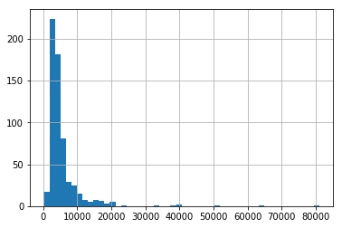
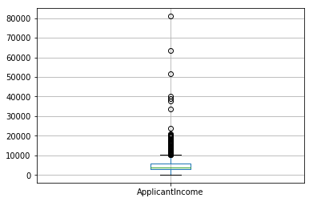
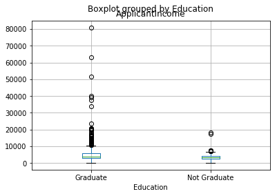
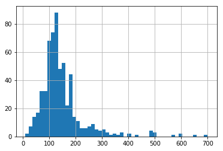
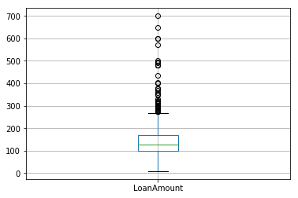
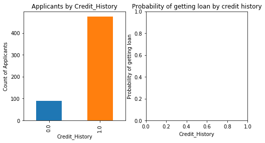
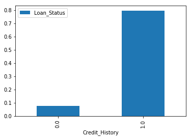
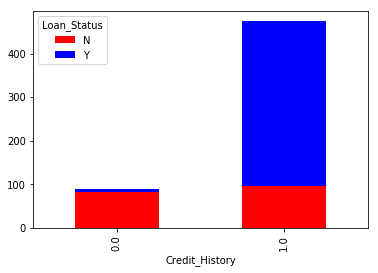
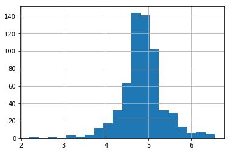

# HW4 - Machine Learning with Python 

This file containes the sample from HW4.ipynb

## Setups


```python
%pylab inline
```

    Populating the interactive namespace from numpy and matplotlib
    


```python
import pandas as pd
import numpy as np
import matplotlib as plt
```

Loading the data into data frame.


```python
df = pd.read_csv("./data/train.csv")
```

Let's have a look at the top rows of the data. 


```python
df.head(10)
```


<div>
<style scoped>
    .dataframe tbody tr th:only-of-type {
        vertical-align: middle;
    }

    .dataframe tbody tr th {
        vertical-align: top;
    }

    .dataframe thead th {
        text-align: right;
    }
</style>
<table border="1" class="dataframe">
  <thead>
    <tr style="text-align: right;">
      <th></th>
      <th>Loan_ID</th>
      <th>Gender</th>
      <th>Married</th>
      <th>Dependents</th>
      <th>Education</th>
      <th>Self_Employed</th>
      <th>ApplicantIncome</th>
      <th>CoapplicantIncome</th>
      <th>LoanAmount</th>
      <th>Loan_Amount_Term</th>
      <th>Credit_History</th>
      <th>Property_Area</th>
      <th>Loan_Status</th>
    </tr>
  </thead>
  <tbody>
    <tr>
      <th>0</th>
      <td>LP001002</td>
      <td>Male</td>
      <td>No</td>
      <td>0</td>
      <td>Graduate</td>
      <td>No</td>
      <td>5849</td>
      <td>0.0</td>
      <td>NaN</td>
      <td>360.0</td>
      <td>1.0</td>
      <td>Urban</td>
      <td>Y</td>
    </tr>
    <tr>
      <th>1</th>
      <td>LP001003</td>
      <td>Male</td>
      <td>Yes</td>
      <td>1</td>
      <td>Graduate</td>
      <td>No</td>
      <td>4583</td>
      <td>1508.0</td>
      <td>128.0</td>
      <td>360.0</td>
      <td>1.0</td>
      <td>Rural</td>
      <td>N</td>
    </tr>
    <tr>
      <th>2</th>
      <td>LP001005</td>
      <td>Male</td>
      <td>Yes</td>
      <td>0</td>
      <td>Graduate</td>
      <td>Yes</td>
      <td>3000</td>
      <td>0.0</td>
      <td>66.0</td>
      <td>360.0</td>
      <td>1.0</td>
      <td>Urban</td>
      <td>Y</td>
    </tr>
    <tr>
      <th>3</th>
      <td>LP001006</td>
      <td>Male</td>
      <td>Yes</td>
      <td>0</td>
      <td>Not Graduate</td>
      <td>No</td>
      <td>2583</td>
      <td>2358.0</td>
      <td>120.0</td>
      <td>360.0</td>
      <td>1.0</td>
      <td>Urban</td>
      <td>Y</td>
    </tr>
    <tr>
      <th>4</th>
      <td>LP001008</td>
      <td>Male</td>
      <td>No</td>
      <td>0</td>
      <td>Graduate</td>
      <td>No</td>
      <td>6000</td>
      <td>0.0</td>
      <td>141.0</td>
      <td>360.0</td>
      <td>1.0</td>
      <td>Urban</td>
      <td>Y</td>
    </tr>
    <tr>
      <th>5</th>
      <td>LP001011</td>
      <td>Male</td>
      <td>Yes</td>
      <td>2</td>
      <td>Graduate</td>
      <td>Yes</td>
      <td>5417</td>
      <td>4196.0</td>
      <td>267.0</td>
      <td>360.0</td>
      <td>1.0</td>
      <td>Urban</td>
      <td>Y</td>
    </tr>
    <tr>
      <th>6</th>
      <td>LP001013</td>
      <td>Male</td>
      <td>Yes</td>
      <td>0</td>
      <td>Not Graduate</td>
      <td>No</td>
      <td>2333</td>
      <td>1516.0</td>
      <td>95.0</td>
      <td>360.0</td>
      <td>1.0</td>
      <td>Urban</td>
      <td>Y</td>
    </tr>
    <tr>
      <th>7</th>
      <td>LP001014</td>
      <td>Male</td>
      <td>Yes</td>
      <td>3+</td>
      <td>Graduate</td>
      <td>No</td>
      <td>3036</td>
      <td>2504.0</td>
      <td>158.0</td>
      <td>360.0</td>
      <td>0.0</td>
      <td>Semiurban</td>
      <td>N</td>
    </tr>
    <tr>
      <th>8</th>
      <td>LP001018</td>
      <td>Male</td>
      <td>Yes</td>
      <td>2</td>
      <td>Graduate</td>
      <td>No</td>
      <td>4006</td>
      <td>1526.0</td>
      <td>168.0</td>
      <td>360.0</td>
      <td>1.0</td>
      <td>Urban</td>
      <td>Y</td>
    </tr>
    <tr>
      <th>9</th>
      <td>LP001020</td>
      <td>Male</td>
      <td>Yes</td>
      <td>1</td>
      <td>Graduate</td>
      <td>No</td>
      <td>12841</td>
      <td>10968.0</td>
      <td>349.0</td>
      <td>360.0</td>
      <td>1.0</td>
      <td>Semiurban</td>
      <td>N</td>
    </tr>
  </tbody>
</table>
</div>


And by using the describe() function we can look at the summary of numerical fields.


```python
df.describe()
```


<div>
<style scoped>
    .dataframe tbody tr th:only-of-type {
        vertical-align: middle;
    }

    .dataframe tbody tr th {
        vertical-align: top;
    }

    .dataframe thead th {
        text-align: right;
    }
</style>
<table border="1" class="dataframe">
  <thead>
    <tr style="text-align: right;">
      <th></th>
      <th>ApplicantIncome</th>
      <th>CoapplicantIncome</th>
      <th>LoanAmount</th>
      <th>Loan_Amount_Term</th>
      <th>Credit_History</th>
    </tr>
  </thead>
  <tbody>
    <tr>
      <th>count</th>
      <td>614.000000</td>
      <td>614.000000</td>
      <td>592.000000</td>
      <td>600.00000</td>
      <td>564.000000</td>
    </tr>
    <tr>
      <th>mean</th>
      <td>5403.459283</td>
      <td>1621.245798</td>
      <td>146.412162</td>
      <td>342.00000</td>
      <td>0.842199</td>
    </tr>
    <tr>
      <th>std</th>
      <td>6109.041673</td>
      <td>2926.248369</td>
      <td>85.587325</td>
      <td>65.12041</td>
      <td>0.364878</td>
    </tr>
    <tr>
      <th>min</th>
      <td>150.000000</td>
      <td>0.000000</td>
      <td>9.000000</td>
      <td>12.00000</td>
      <td>0.000000</td>
    </tr>
    <tr>
      <th>25%</th>
      <td>2877.500000</td>
      <td>0.000000</td>
      <td>100.000000</td>
      <td>360.00000</td>
      <td>1.000000</td>
    </tr>
    <tr>
      <th>50%</th>
      <td>3812.500000</td>
      <td>1188.500000</td>
      <td>128.000000</td>
      <td>360.00000</td>
      <td>1.000000</td>
    </tr>
    <tr>
      <th>75%</th>
      <td>5795.000000</td>
      <td>2297.250000</td>
      <td>168.000000</td>
      <td>360.00000</td>
      <td>1.000000</td>
    </tr>
    <tr>
      <th>max</th>
      <td>81000.000000</td>
      <td>41667.000000</td>
      <td>700.000000</td>
      <td>480.00000</td>
      <td>1.000000</td>
    </tr>
  </tbody>
</table>
</div>


## Task 1 : inferencing from describe()

1. By looking on the output of the describe() function we can see that there 22 missing values of LoanAmount , 14 Loan_Amount_Term and 50 Credit_History.
2. The Credit_History has value 1 for those who have a credit history and 0 otherwise. So , the Mean value in the table above is the percentage (84.2%).
3. The ApplicantIncome distribution seems to be in line with expectation. Same with CoapplicantIncome. Please note that we can get an idea of a possible skew in the data by comparing the mean to the median, i.e. the 50% figure.

## Distribution analysis
Now that we are familiar with basic data characteristics, let us study distribution of various variables. Let us start with numeric variables – namely ApplicantIncome and LoanAmount

Lets start by plotting the histogram of ApplicantIncome using the following commands:


```python
df['ApplicantIncome'].hist(bins = 50)
```


    <matplotlib.axes._subplots.AxesSubplot at 0x113c4748>





Here we observe that there are few extreme values. This is also the reason why 50 bins are required to depict the distribution clearly.

Next, we look at box plots to understand the distributions. Box plot can be plotted by:


```python
df.boxplot(column='ApplicantIncome')
```


    <matplotlib.axes._subplots.AxesSubplot at 0x113f8cc0>





This confirms the presence of a lot of outliers/extreme values. This can be attributed to the income disparity in the society. Part of this can be driven by the fact that we are looking at people with different education levels. Let us segregate them by Education:


```python
df.boxplot(column='ApplicantIncome', by = 'Education')
```


    <matplotlib.axes._subplots.AxesSubplot at 0x114c3470>





We can see that there is no substantial different between the mean income of graduate and non-graduates. But there are a higher number of graduates with very high incomes, which are appearing to be the outliers.

## Task 2: Distribution Analysis

The histogram of LoanAmount : 


```python
df['LoanAmount'].hist(bins = 50)
```


    <matplotlib.axes._subplots.AxesSubplot at 0x115355c0>





The boxplot of LoanAmount 


```python
df.boxplot(column='LoanAmount')
```


    <matplotlib.axes._subplots.AxesSubplot at 0x11535160>





## Categorical variable analysis
Frequency Table for Credit History:


```python
temp1 = df['Credit_History'].value_counts(ascending=True)
temp1
```


    0.0     89
    1.0    475
    Name: Credit_History, dtype: int64


Probability of getting loan for each Credit History class:


```python
temp2 = df.pivot_table(values='Loan_Status',index=['Credit_History'],aggfunc=lambda x: x.map({'Y':1,'N':0}).mean())
temp2
```


<div>
<style scoped>
    .dataframe tbody tr th:only-of-type {
        vertical-align: middle;
    }

    .dataframe tbody tr th {
        vertical-align: top;
    }

    .dataframe thead th {
        text-align: right;
    }
</style>
<table border="1" class="dataframe">
  <thead>
    <tr style="text-align: right;">
      <th></th>
      <th>Loan_Status</th>
    </tr>
    <tr>
      <th>Credit_History</th>
      <th></th>
    </tr>
  </thead>
  <tbody>
    <tr>
      <th>0.0</th>
      <td>0.078652</td>
    </tr>
    <tr>
      <th>1.0</th>
      <td>0.795789</td>
    </tr>
  </tbody>
</table>
</div>


This can be plotted as a bar chart using the “matplotlib” library with following code:


```python
import matplotlib.pyplot as plt
fig = plt.figure(figsize=(8,4))
ax1 = fig.add_subplot(121)
ax1.set_xlabel('Credit_History')
ax1.set_ylabel('Count of Applicants')
ax1.set_title("Applicants by Credit_History")
temp1.plot(kind='bar')

ax2 = fig.add_subplot(122)
temp2.plot(kind = 'bar')
ax2.set_xlabel('Credit_History')
ax2.set_ylabel('Probability of getting loan')
ax2.set_title("Probability of getting loan by credit history")
```


    Text(0.5,1,u'Probability of getting loan by credit history')








This shows that the chances of getting a loan are eight-fold if the applicant has a valid credit history. You can plot similar graphs by Married, Self-Employed, Property_Area, etc.

Alternately, these two plots can also be visualized by combining them in a stacked chart:


```python
temp3 = pd.crosstab(df['Credit_History'], df['Loan_Status'])
temp3.plot(kind='bar', stacked=True, color=['red','blue'], grid=False)
```


    <matplotlib.axes._subplots.AxesSubplot at 0x11dee630>





We just saw how we can do exploratory analysis in Python using Pandas. I hope your love for pandas (the animal) would have increased by now – given the amount of help, the library can provide you in analyzing datasets.

Next let’s explore ApplicantIncome and LoanStatus variables further, perform data munging and create a dataset for applying various modeling techniques. I would strongly urge that you take another dataset and problem and go through an independent example before reading further.

# Data Munging in Python : Using Pandas
## Data munging – recap of the need
While our exploration of the data, we found a few problems in the data set, which needs to be solved before the data is ready for a good model. This exercise is typically referred as “Data Munging”. Here are the problems, we are already aware of:

1. There are missing values in some variables. We should estimate those values wisely depending on the amount of missing values and the expected importance of variables.
2. While looking at the distributions, we saw that ApplicantIncome and LoanAmount seemed to contain extreme values at either end. Though they might make intuitive sense, but should be treated appropriately.

In addition to these problems with numerical fields, we should also look at the non-numerical fields i.e. Gender, Property_Area, Married, Education and Dependents to see, if they contain any useful information.

## Check missing values in the dataset
Let us look at missing values in all the variables because most of the models don’t work with missing data and even if they do, imputing them helps more often than not. So, let us check the number of nulls / NaNs in the dataset.

This command should tell us the number of missing values in each column as isnull() returns 1, if the value is null.


```python
df.apply(lambda x: sum(x.isnull()),axis=0) 
```


    Loan_ID               0
    Gender               13
    Married               3
    Dependents           15
    Education             0
    Self_Employed        32
    ApplicantIncome       0
    CoapplicantIncome     0
    LoanAmount           22
    Loan_Amount_Term     14
    Credit_History       50
    Property_Area         0
    Loan_Status           0
    dtype: int64


Though the missing values are not very high in number, but many variables have them and each one of these should be estimated and added in the data.

Note: Remember that missing values may not always be NaNs. For instance, if the Loan_Amount_Term is 0, does it makes sense or would you consider that missing? I suppose your answer is missing and you’re right. So we should check for values which are unpractical.

## How to fill missing values in LoanAmount?
How to fill missing values in LoanAmount?

There are numerous ways to fill the missing values of loan amount – the simplest being replacement by mean, which can be done by following code:


```python
# df['LoanAmount'].fillna(df['LoanAmount'].mean(), inplace=True)
```

The other extreme could be to build a supervised learning model to predict loan amount on the basis of other variables and then use age along with other variables to predict survival.

Since, the purpose now is to bring out the steps in data munging, I’ll rather take an approach, which lies some where in between these 2 extremes. A key hypothesis is that whether a person is educated or self-employed can combine to give a good estimate of loan amount.

But first, we have to ensure that each of Self_Employed and Education variables should not have a missing values.

As we say earlier, Self_Employed has some missing values. Let’s look at the frequency table:


```python
df['Self_Employed'].value_counts()
```


    No     500
    Yes     82
    Name: Self_Employed, dtype: int64


Since ~86% values are “No”, it is safe to impute the missing values as “No” as there is a high probability of success. This can be done using the following code:


```python
df['Self_Employed'].fillna('No',inplace=True)
```

Now, we will create a Pivot table, which provides us median values for all the groups of unique values of Self_Employed and Education features. Next, we define a function, which returns the values of these cells and apply it to fill the missing values of loan amount:


```python
table = df.pivot_table(values='LoanAmount', index='Self_Employed' ,columns='Education', aggfunc=np.median)
table
```


<div>
<style scoped>
    .dataframe tbody tr th:only-of-type {
        vertical-align: middle;
    }

    .dataframe tbody tr th {
        vertical-align: top;
    }

    .dataframe thead th {
        text-align: right;
    }
</style>
<table border="1" class="dataframe">
  <thead>
    <tr style="text-align: right;">
      <th>Education</th>
      <th>Graduate</th>
      <th>Not Graduate</th>
    </tr>
    <tr>
      <th>Self_Employed</th>
      <th></th>
      <th></th>
    </tr>
  </thead>
  <tbody>
    <tr>
      <th>No</th>
      <td>130.0</td>
      <td>113.0</td>
    </tr>
    <tr>
      <th>Yes</th>
      <td>157.5</td>
      <td>130.0</td>
    </tr>
  </tbody>
</table>
</div>


Define function to return value of this pivot_table:


```python
def fage(x):
 return table.loc[x['Self_Employed'],x['Education']]
```

Replace missing values:


```python
df['LoanAmount'].fillna(df[df['LoanAmount'].isnull()].apply(fage, axis=1), inplace=True)
```

This should provide you a good way to impute missing values of loan amount.

## How to treat for extreme values in distribution of LoanAmount and ApplicantIncome?


```python
df['LoanAmount_log'] = np.log(df['LoanAmount'])
df['LoanAmount_log'].hist(bins=20)
```


    <matplotlib.axes._subplots.AxesSubplot at 0x14293a58>





Now the distribution looks much closer to normal and effect of extreme values has been significantly subsided.

Coming to ApplicantIncome. One intuition can be that some applicants have lower income but strong support Co-applicants. So it might be a good idea to combine both incomes as total income and take a log transformation of the same.


```python
df['TotalIncome'] = df['ApplicantIncome'] + df['CoapplicantIncome']
df['TotalIncome_log'] = np.log(df['TotalIncome'])
df['LoanAmount_log'].hist(bins=20) 
```


    <matplotlib.axes._subplots.AxesSubplot at 0x1462bc50>


Now we see that the distribution is much better than before.

# Task 3: Remove nulls

1. Impute the missing values for Gender, Married, Dependents, Loan_Amount_Term, Credit_History


```python
df['Credit_History'].fillna(1, inplace=True)
df['Loan_Amount_Term'].fillna(360,inplace=True)
df['Dependents'].fillna(0, inplace=True)
df['Married'].fillna('Yes', inplace=True)
df['Gender'].fillna('Male', inplace=True)
```

# Building a Predictive Model in Python

After, we have made the data useful for modeling, let’s now look at the python code to create a predictive model on our data set. Skicit-Learn (sklearn) is the most commonly used library in Python for this purpose and we will follow the trail.

Since, sklearn requires all inputs to be numeric, we should convert all our categorical variables into numeric by encoding the categories. This can be done using the following code:


```python
df.dtypes
```


    Loan_ID               object
    Gender                object
    Married               object
    Dependents            object
    Education             object
    Self_Employed         object
    ApplicantIncome        int64
    CoapplicantIncome    float64
    LoanAmount           float64
    Loan_Amount_Term     float64
    Credit_History       float64
    Property_Area         object
    Loan_Status           object
    LoanAmount_log       float64
    TotalIncome          float64
    TotalIncome_log      float64
    dtype: object


```python
from sklearn.preprocessing import LabelEncoder
var_mod = ['Gender','Married','Dependents','Education','Self_Employed','Property_Area','Loan_Status']
le = LabelEncoder()
for i in var_mod:
    df[i] = le.fit_transform(df[i].astype(str))
```


```python
df.dtypes
```


    Loan_ID               object
    Gender                 int64
    Married                int64
    Dependents             int64
    Education              int64
    Self_Employed          int64
    ApplicantIncome        int64
    CoapplicantIncome    float64
    LoanAmount           float64
    Loan_Amount_Term     float64
    Credit_History       float64
    Property_Area          int64
    Loan_Status            int64
    LoanAmount_log       float64
    TotalIncome          float64
    TotalIncome_log      float64
    dtype: object


Next, we will import the required modules. Then we will define a generic classification function, which takes a model as input and determines the Accuracy and Cross-Validation scores.


```python
#Import models from scikit learn module:
from sklearn.linear_model import LogisticRegression
from sklearn.cross_validation import KFold   #For K-fold cross validation
from sklearn.ensemble import RandomForestClassifier
from sklearn.tree import DecisionTreeClassifier, export_graphviz
from sklearn import metrics

#Generic function for making a classification model and accessing performance:
def classification_model(model, data, predictors, outcome):
  #Fit the model:
  model.fit(data[predictors],data[outcome])
  
  #Make predictions on training set:
  predictions = model.predict(data[predictors])
  
  #Print accuracy
  accuracy = metrics.accuracy_score(predictions,data[outcome])
  print("Accuracy : %s" % "{0:.3%}".format(accuracy))

  #Perform k-fold cross-validation with 5 folds
  kf = KFold(data.shape[0], n_folds=5)
  error = []
  for train, test in kf:
    # Filter training data
    train_predictors = (data[predictors].iloc[train,:])
    
    # The target we're using to train the algorithm.
    train_target = data[outcome].iloc[train]
    
    # Training the algorithm using the predictors and target.
    model.fit(train_predictors, train_target)
    
    #Record error from each cross-validation run
    error.append(model.score(data[predictors].iloc[test,:], data[outcome].iloc[test]))
 
  print("Cross-Validation Score : %s" % "{0:.3%}".format(np.mean(error)))

  #Fit the model again so that it can be refered outside the function:
  model.fit(data[predictors],data[outcome]) 
```

    C:\Python27\lib\site-packages\sklearn\cross_validation.py:41: DeprecationWarning: This module was deprecated in version 0.18 in favor of the model_selection module into which all the refactored classes and functions are moved. Also note that the interface of the new CV iterators are different from that of this module. This module will be removed in 0.20.
      "This module will be removed in 0.20.", DeprecationWarning)
    

## Logistic Regression
Let’s make our first Logistic Regression model. One way would be to take all the variables into the model but this might result in overfitting. In simple words, taking all variables might result in the model understanding complex relations specific to the data and will not generalize well.

We can easily make some intuitive hypothesis to set the ball rolling. The chances of getting a loan will be higher for:

1. Applicants having a credit history (remember we observed this in exploration?)
2. Applicants with higher applicant and co-applicant incomes
3. Applicants with higher education level
4. Properties in urban areas with high growth perspectives
So let’s make our first model with ‘Credit_History’.


```python
outcome_var = 'Loan_Status'
model = LogisticRegression()
predictor_var = ['Credit_History']
classification_model(model, df,predictor_var,outcome_var)
```

    Accuracy : 80.945%
    Cross-Validation Score : 80.946%
    

We can try different combination of variables:


```python
predictor_var = ['Credit_History','Education','Married','Self_Employed','Property_Area']
classification_model(model, df,predictor_var,outcome_var)
```

    Accuracy : 80.945%
    Cross-Validation Score : 80.946%
    

Generally we expect the accuracy to increase on adding variables. But this is a more challenging case. The accuracy and cross-validation score are not getting impacted by less important variables. Credit_History is dominating the mode. We have two options now:

1. Feature Engineering: dereive new information and try to predict those. I will leave this to your creativity.
2. Better modeling techniques. Let’s explore this next.

## Decision Tree

Decision tree is another method for making a predictive model. It is known to provide higher accuracy than logistic regression model.


```python
model = DecisionTreeClassifier()
predictor_var = ['Credit_History','Gender','Married','Education']
classification_model(model, df,predictor_var,outcome_var)
```

    Accuracy : 80.945%
    Cross-Validation Score : 80.946%
    

Here the model based on categorical variables is unable to have an impact because Credit History is dominating over them. Let’s try a few numerical variables:

#Task 4: Modeling the Data

1. Let's train a decision tree classifier that accepts the following attributes as input: Credit_History, Loan_Amount_Term, LoanAmount_log.


```python
df.describe()
```


<div>
<style scoped>
    .dataframe tbody tr th:only-of-type {
        vertical-align: middle;
    }

    .dataframe tbody tr th {
        vertical-align: top;
    }

    .dataframe thead th {
        text-align: right;
    }
</style>
<table border="1" class="dataframe">
  <thead>
    <tr style="text-align: right;">
      <th></th>
      <th>Gender</th>
      <th>Married</th>
      <th>Dependents</th>
      <th>Education</th>
      <th>Self_Employed</th>
      <th>ApplicantIncome</th>
      <th>CoapplicantIncome</th>
      <th>LoanAmount</th>
      <th>Loan_Amount_Term</th>
      <th>Credit_History</th>
      <th>Property_Area</th>
      <th>Loan_Status</th>
      <th>LoanAmount_log</th>
      <th>TotalIncome</th>
      <th>TotalIncome_log</th>
    </tr>
  </thead>
  <tbody>
    <tr>
      <th>count</th>
      <td>614.000000</td>
      <td>614.000000</td>
      <td>614.000000</td>
      <td>614.000000</td>
      <td>614.000000</td>
      <td>614.000000</td>
      <td>614.000000</td>
      <td>614.000000</td>
      <td>614.000000</td>
      <td>614.000000</td>
      <td>614.000000</td>
      <td>614.000000</td>
      <td>614.000000</td>
      <td>614.000000</td>
      <td>614.000000</td>
    </tr>
    <tr>
      <th>mean</th>
      <td>0.817590</td>
      <td>0.653094</td>
      <td>0.744300</td>
      <td>0.218241</td>
      <td>0.133550</td>
      <td>5403.459283</td>
      <td>1621.245798</td>
      <td>145.764658</td>
      <td>342.410423</td>
      <td>0.855049</td>
      <td>1.037459</td>
      <td>0.687296</td>
      <td>4.857146</td>
      <td>7024.705081</td>
      <td>8.669414</td>
    </tr>
    <tr>
      <th>std</th>
      <td>0.386497</td>
      <td>0.476373</td>
      <td>1.009623</td>
      <td>0.413389</td>
      <td>0.340446</td>
      <td>6109.041673</td>
      <td>2926.248369</td>
      <td>84.145700</td>
      <td>64.428629</td>
      <td>0.352339</td>
      <td>0.787482</td>
      <td>0.463973</td>
      <td>0.496392</td>
      <td>6458.663872</td>
      <td>0.545102</td>
    </tr>
    <tr>
      <th>min</th>
      <td>0.000000</td>
      <td>0.000000</td>
      <td>0.000000</td>
      <td>0.000000</td>
      <td>0.000000</td>
      <td>150.000000</td>
      <td>0.000000</td>
      <td>9.000000</td>
      <td>12.000000</td>
      <td>0.000000</td>
      <td>0.000000</td>
      <td>0.000000</td>
      <td>2.197225</td>
      <td>1442.000000</td>
      <td>7.273786</td>
    </tr>
    <tr>
      <th>25%</th>
      <td>1.000000</td>
      <td>0.000000</td>
      <td>0.000000</td>
      <td>0.000000</td>
      <td>0.000000</td>
      <td>2877.500000</td>
      <td>0.000000</td>
      <td>100.250000</td>
      <td>360.000000</td>
      <td>1.000000</td>
      <td>0.000000</td>
      <td>0.000000</td>
      <td>4.607658</td>
      <td>4166.000000</td>
      <td>8.334712</td>
    </tr>
    <tr>
      <th>50%</th>
      <td>1.000000</td>
      <td>1.000000</td>
      <td>0.000000</td>
      <td>0.000000</td>
      <td>0.000000</td>
      <td>3812.500000</td>
      <td>1188.500000</td>
      <td>128.000000</td>
      <td>360.000000</td>
      <td>1.000000</td>
      <td>1.000000</td>
      <td>1.000000</td>
      <td>4.852030</td>
      <td>5416.500000</td>
      <td>8.597205</td>
    </tr>
    <tr>
      <th>75%</th>
      <td>1.000000</td>
      <td>1.000000</td>
      <td>1.000000</td>
      <td>0.000000</td>
      <td>0.000000</td>
      <td>5795.000000</td>
      <td>2297.250000</td>
      <td>164.750000</td>
      <td>360.000000</td>
      <td>1.000000</td>
      <td>2.000000</td>
      <td>1.000000</td>
      <td>5.104426</td>
      <td>7521.750000</td>
      <td>8.925549</td>
    </tr>
    <tr>
      <th>max</th>
      <td>1.000000</td>
      <td>1.000000</td>
      <td>3.000000</td>
      <td>1.000000</td>
      <td>1.000000</td>
      <td>81000.000000</td>
      <td>41667.000000</td>
      <td>700.000000</td>
      <td>480.000000</td>
      <td>1.000000</td>
      <td>2.000000</td>
      <td>1.000000</td>
      <td>6.551080</td>
      <td>81000.000000</td>
      <td>11.302204</td>
    </tr>
  </tbody>
</table>
</div>


```python
model2 = DecisionTreeClassifier()
predictor_var = ['Credit_History','Loan_Amount_Term','LoanAmount_log']
classification_model(model2, df,predictor_var,outcome_var)
```

    Accuracy : 88.925%
    Cross-Validation Score : 69.536%
    

2.Not much better according to the test score

## Random Forest 

Random forest is another algorithm for solving the classification problem.

An advantage with Random Forest is that we can make it work with all the features and it returns a feature importance matrix which can be used to select features.


```python
model = RandomForestClassifier(n_estimators=100)
predictor_var = ['Gender', 'Married', 'Dependents', 'Education',
       'Self_Employed', 'Loan_Amount_Term', 'Credit_History', 'Property_Area',
        'LoanAmount_log','TotalIncome_log']
classification_model(model, df,predictor_var,outcome_var)
```

    Accuracy : 100.000%
    Cross-Validation Score : 77.366%
    

Here we see that the accuracy is 100% for the training set. This is the ultimate case of overfitting and can be resolved in two ways:
1. Reducing the number of predictors
2. Tuning the model parameters

Let’s try both of these. First we see the feature importance matrix from which we’ll take the most important features.


```python
#Create a series with feature importances:
featimp = pd.Series(model.feature_importances_, index=predictor_var).sort_values(ascending=False)
print(featimp)
```

    Credit_History      0.272339
    TotalIncome_log     0.269909
    LoanAmount_log      0.227553
    Dependents          0.051188
    Property_Area       0.046370
    Loan_Amount_Term    0.040714
    Married             0.026788
    Education           0.022286
    Self_Employed       0.022044
    Gender              0.020809
    dtype: float64
    

Let’s use the top 5 variables for creating a model. Also, we will modify the parameters of random forest model a little bit:


```python
model = RandomForestClassifier(n_estimators=25, min_samples_split=25, max_depth=7, max_features=1)
predictor_var = ['TotalIncome_log','LoanAmount_log','Credit_History','Dependents','Property_Area']
classification_model(model, df,predictor_var,outcome_var)
```

    Accuracy : 82.736%
    Cross-Validation Score : 80.622%
    

Notice that although accuracy reduced, but the cross-validation score is improving showing that the model is generalizing well. Remember that random forest models are not exactly repeatable. Different runs will result in slight variations because of randomization. But the output should stay in the ballpark.

You would have noticed that even after some basic parameter tuning on random forest, we have reached a cross-validation accuracy only slightly better than the original logistic regression model. This exercise gives us some very interesting and unique learning:

1. Using a more sophisticated model does not guarantee better results.
2. Avoid using complex modeling techniques as a black box without understanding the underlying concepts. Doing so would increase the tendency of overfitting thus making your models less interpretable. 
3. Feature Engineering is the key to success. Everyone can use an Xgboost models but the real art and creativity lies in enhancing your features to better suit the model.

Be proud of yourself for getting this far! You are invited to improve your result and submit to the site to test your place in the leaderboard.
