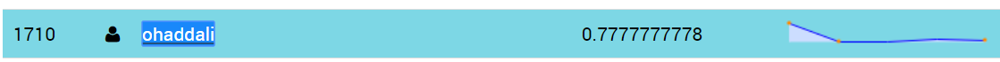
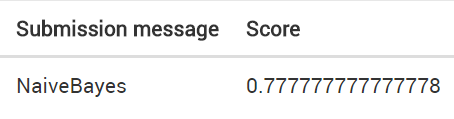

# Prediction 1 - Using Naive Bayes

### Naive Bayes classifier is probabilistic calssifier based on applying Bayes' theorem with strong independence assumptions between the features.
In this document we use the Gaussian naive Bayes classifier.

With this algorithm we got the best result that placed us in :




##Pre Processing the data

Installing the needed packages.


```python
%pylab inline
import pandas as pd
import numpy as np
```

    Populating the interactive namespace from numpy and matplotlib
    

Reading the data into dataframe.


```python
df = pd.read_csv("./data/train.csv")
```

### Remove Nulls

To impute all the missing values in the data frame we will use the fillna method using information from HW4 file.

First we need to impute the missing values from the Self_Employed column, in order to use it to create a Pivot Table to fill the nulls from LoanAmount column.


```python
df['Self_Employed'].fillna('No',inplace=True)

table = df.pivot_table(values='LoanAmount', index='Self_Employed' ,columns='Education', aggfunc=np.median)
def fage(x):
 return table.loc[x['Self_Employed'],x['Education']]
df['LoanAmount'].fillna(df[df['LoanAmount'].isnull()].apply(fage, axis=1), inplace=True)
```

We will impute the missing values for the rest of the columns using previous information from HW4 file. 


```python

df['Credit_History'].fillna(1, inplace=True)
df['Loan_Amount_Term'].fillna(360,inplace=True)
df['Dependents'].fillna(0, inplace=True)
df['Married'].fillna('Yes', inplace=True)
df['Gender'].fillna('Male', inplace=True)
```

## Building a Predictive Model in Python

Now we will build the Naive Bayes model on our data set.
Like in the example we will use the Skicit-Learn library, that requires from us to convert all inputs to numeric.

Next, we will import the required modules. 


```python
from sklearn.naive_bayes import GaussianNB
from sklearn import metrics
from sklearn.cross_validation import KFold
```

    C:\Python27\lib\site-packages\sklearn\cross_validation.py:41: DeprecationWarning: This module was deprecated in version 0.18 in favor of the model_selection module into which all the refactored classes and functions are moved. Also note that the interface of the new CV iterators are different from that of this module. This module will be removed in 0.20.
      "This module will be removed in 0.20.", DeprecationWarning)
    

Convert all the categorival variables into numeric


```python
from sklearn.preprocessing import LabelEncoder
var_mod = ['Gender','Married','Dependents','Education','Self_Employed','Property_Area','Loan_Status']
le = LabelEncoder()
for i in var_mod:
    df[i] = le.fit_transform(df[i].astype(str))
```

Now let's train the model on our data set. We will use only those variables : LoanAmount , Education , Property_Area , Credit_History


```python
nbModel = GaussianNB()
predictor_vars = ['LoanAmount','Education','Property_Area','Credit_History']
outcome_var = ['Loan_Status']
nbModel.fit(df[predictor_vars],df[outcome_var])

predictions = nbModel.predict(df[predictor_vars])
```

    C:\Python27\lib\site-packages\sklearn\utils\validation.py:578: DataConversionWarning: A column-vector y was passed when a 1d array was expected. Please change the shape of y to (n_samples, ), for example using ravel().
      y = column_or_1d(y, warn=True)
    

The accuracy of this training:


```python
print("Accuracy : %s" % "{0:.3%}".format(metrics.accuracy_score(predictions,df[outcome_var])))
```

    Accuracy : 80.945%
    

Perform k-fold CV with 5 folds


```python
kf = KFold(df.shape[0], n_folds=5)
error = [] 
for train ,test  in kf:
    train_predictors = (df[predictor_vars].iloc[train,:])
    train_target = df[outcome_var].iloc[train]
    
    # Training the algorithm using the predictors and target.
    nbModel.fit(train_predictors, train_target)
    
    #Record error from each cross-validation run
    error.append(nbModel.score(df[predictor_vars].iloc[test,:], df[outcome_var].iloc[test]))
    
print("Cross-Validation Score : %s" % "{0:.3%}".format(np.mean(error)))
nbModel.fit(df[predictor_vars],df[outcome_var])
```

    Cross-Validation Score : 80.457%
    


    GaussianNB(priors=None)


### The test data set
Now let's load the test data_set : 


```python
df_test = pd.read_csv("./data/test.csv")
```

We need to pre-process the data in the same way we used on the train set.


```python
df_test['Self_Employed'].fillna('No',inplace=True)
df_test['LoanAmount'].fillna(df_test[df_test['LoanAmount'].isnull()].apply(fage, axis=1), inplace=True)
df_test['Credit_History'].fillna(1, inplace=True)
df_test['Loan_Amount_Term'].fillna(360,inplace=True)
df_test['Dependents'].fillna(0, inplace=True)
df_test['Married'].fillna('Yes', inplace=True)
df_test['Gender'].fillna('Male', inplace=True)
```

And convert the columns to numeric


```python
var_mod = ['Gender','Married','Dependents','Education','Self_Employed','Property_Area']
le = LabelEncoder()
for i in var_mod:
    df_test[i] = le.fit_transform(df_test[i].astype(str))
```

We will predict only the variables we chose before :LoanAmount , Education , Property_Area , Credit_History


```python
loan_ids = df_test['Loan_ID']
df_test = df_test[predictor_vars]
result = nbModel.predict(df_test)
result
```


    array([1, 1, 1, 1, 1, 1, 1, 0, 1, 1, 1, 1, 1, 0, 1, 1, 1, 1, 1, 1, 1, 1,
           1, 1, 1, 0, 1, 1, 1, 1, 1, 1, 1, 1, 1, 0, 1, 1, 1, 1, 1, 1, 1, 1,
           1, 1, 1, 1, 1, 1, 1, 1, 1, 1, 1, 0, 1, 1, 0, 1, 1, 1, 1, 0, 1, 1,
           0, 0, 1, 0, 1, 1, 1, 1, 1, 1, 1, 1, 1, 1, 0, 1, 0, 1, 0, 1, 1, 1,
           1, 1, 1, 1, 1, 1, 0, 1, 1, 1, 1, 1, 1, 0, 1, 1, 1, 1, 0, 1, 1, 1,
           1, 1, 1, 1, 1, 1, 1, 0, 0, 0, 1, 1, 1, 0, 0, 1, 0, 1, 1, 1, 1, 1,
           1, 1, 1, 1, 1, 1, 1, 1, 0, 1, 0, 1, 1, 1, 1, 0, 1, 1, 1, 1, 1, 0,
           1, 1, 1, 1, 1, 1, 1, 0, 1, 1, 1, 0, 0, 1, 0, 1, 1, 1, 1, 0, 0, 1,
           1, 1, 1, 1, 1, 1, 1, 1, 1, 1, 1, 1, 1, 1, 1, 1, 0, 0, 1, 1, 0, 1,
           0, 1, 1, 1, 1, 1, 1, 1, 1, 1, 1, 1, 1, 0, 1, 1, 1, 1, 1, 1, 1, 1,
           1, 1, 1, 1, 0, 1, 1, 1, 1, 0, 1, 1, 1, 1, 1, 0, 0, 1, 1, 1, 1, 0,
           1, 0, 1, 0, 1, 1, 1, 1, 0, 1, 1, 1, 1, 0, 1, 1, 1, 1, 1, 1, 1, 1,
           1, 1, 0, 1, 0, 1, 1, 1, 1, 0, 0, 1, 1, 1, 0, 1, 1, 1, 1, 1, 1, 1,
           1, 1, 1, 1, 1, 1, 1, 0, 1, 1, 1, 1, 1, 1, 1, 0, 1, 1, 1, 1, 1, 1,
           1, 1, 1, 0, 1, 1, 1, 1, 1, 0, 1, 1, 1, 1, 1, 1, 1, 0, 1, 1, 1, 1,
           1, 1, 1, 1, 1, 1, 1, 1, 1, 0, 1, 1, 1, 1, 1, 1, 0, 1, 1, 1, 1, 1,
           1, 1, 0, 1, 1, 1, 1, 1, 1, 1, 1, 1, 1, 1, 1], dtype=int64)


This result included the nunmbers 1 and 0 , but the expected result is 'Y' and 'N'.


```python
result  = ['Y' if res==1 else 'N' for res in result]
```

Now only remains to write the results to a file and submit it


```python
resultsToWrite = pd.DataFrame({'Loan_ID' : loan_ids, 'Loan_Status' : result})
resultsToWrite.to_csv("NaiveBayes_submission.csv")
```

## The prediction Score

